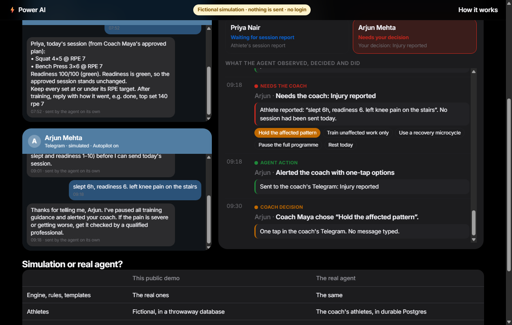
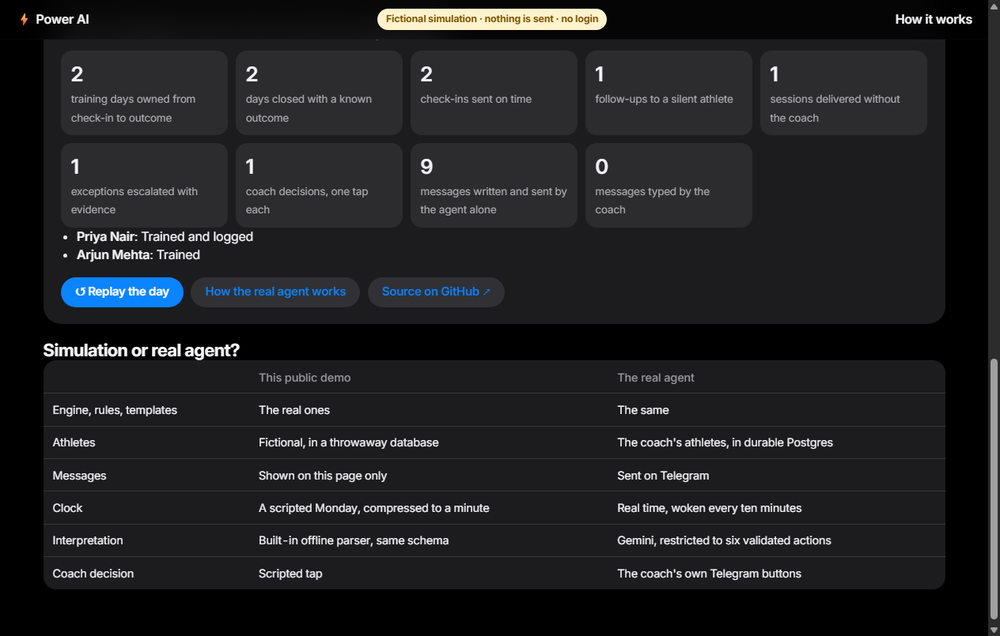
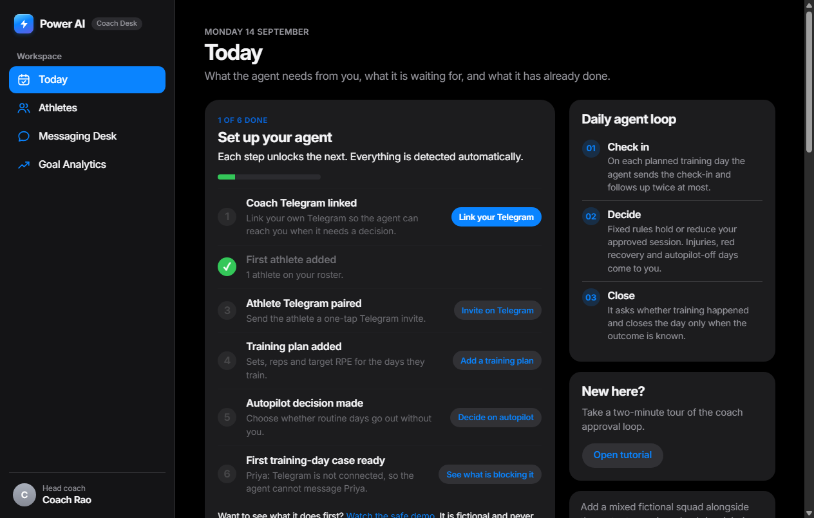
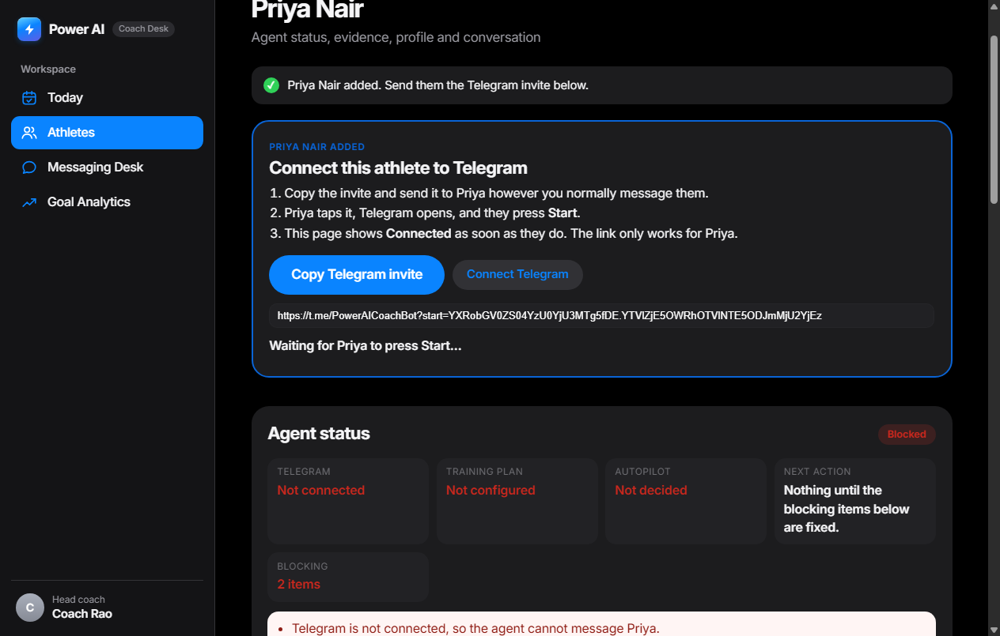

# Power AI — Training-Log Agent

GitHub: <https://github.com/Shlok-K-ps/training-log-agent>  
Live: <https://training-log-agent.onrender.com/>

**A training-day agent for one powerlifting coach and their athletes.**

A powerlifting coach's real job is not writing programs. It is keeping up with
twenty athletes' messages a day, remembering who is hurt, noticing who has gone
quiet, and catching the lifter who has been stuck at the same weight for a month.
That work scales linearly with the roster, and it is the first thing to slip when
the coach gets busy — which is exactly when an athlete most needs someone to notice.

Power AI takes on that routine work. Athletes message the coach's Telegram bot in
plain English. Gemini 2.5 Flash turns each message into validated structured data,
and tested Python rules make the coaching and safety decisions the same way every
time. The agent sends check-ins, follow-ups and permitted sessions on its own, and
brings injuries and other exceptions to the coach.

## What the coach stops doing by hand

| Done by hand | Done by the agent |
|---|---|
| Reading every message and copying numbers into a spreadsheet | The athlete texts; the message is parsed, validated and stored |
| Remembering who is hurt | An injury flag suppresses every load suggestion until a named person clears it |
| Spotting a stall buried in weeks of logs | Stall episodes are recomputed on every message |
| Chasing athletes for sleep and readiness | The agent sends the morning check-in itself, in each athlete's timezone |
| Finding a slot around someone's timetable | Optional calendar planning reads their calendar and travel time and proposes options (built, but not enabled on the hosted deployment) |
| Booking the session | Optional: `confirm CODE` writes it to an app-owned calendar (built, but not enabled on the hosted deployment) |

Nothing here replaces the coach's judgement. It removes the clerical work that
stands between the coach and the two or three athletes who actually need
attention today.

> **Demonstration project.** Power AI is a student-built demonstration run with
> consenting test users. It is not a production medical or health-data system and
> gives no medical advice.

## Start here

| If you want to… | Go here |
|---|---|
| Understand the product quickly | [Watch the 90-second public demo](https://training-log-agent.onrender.com/demo) |
| See why this is an agent, not just a dashboard | [Four parts of the agent](#four-parts-of-the-agent) |
| Follow the real coach-and-athlete workflow | [Set up a real athlete](#setting-up-a-real-athlete) |
| Inspect the implementation | [Architecture](#the-architecture), [rules](#the-rules) and [tests](#tests) |
| Run your own private instance | [Deployment instructions](#5-deploy) |

## See it in 90 seconds

Open the live site and press **Watch the agent work**, or go straight to `/demo`.
No login, no setup, nothing sent.



Two fictional athletes, one Monday, compressed to about 90 seconds:

1. **07:30** The agent checks in with Priya and Arjun on its own.
2. **07:52** Priya replies. Her message becomes validated data, fixed rules score her
   readiness, and her session goes out without the coach.
3. **09:01** Arjun hasn't replied, so the agent follows up.
4. **09:18** Arjun mentions knee pain. Training guidance stops immediately and the coach
   gets the evidence with one-tap options.
5. **09:30** The coach taps a plan; the agent sends it.
6. **20:31** It asks both athletes whether training happened and closes each day on
   their answer, then reports the work it did.

Every step is colour-coded: **interpretation** (the language model), **fixed rule**,
**agent action**, **needs the coach**, **coach decision** and **outcome**.



**Public simulation vs the real agent.** The demo runs the real engine, rules and
message templates on fictional athletes inside a throwaway in-memory database. It
never opens the production database and never contacts Telegram. The coach's own
athletes get the same behaviour for real on Telegram, in real time, with durable
Neon Postgres storage behind a console only the coach can open.

| | Public simulation | Real Telegram agent |
|---|---|---|
| Athletes | Fictional | The coach's athletes |
| Messages | Shown on the page | Sent on Telegram |
| Clock | One scripted day in about 90 seconds | Real time, woken by a GitHub Actions tick |
| Interpretation | Built-in offline parser, same data format | Gemini 2.5 Flash, limited to six validated actions |
| Storage | Temporary in-memory SQLite (demo only) | Neon Postgres |
| Access | Public | Coach only, via a signed Telegram link |

### Setting up a real athlete

An empty console offers two choices: **Set up a real athlete** or **Watch the safe
demo**. A **Set up your agent** checklist then tracks six steps and ticks each one off
automatically: coach Telegram linked, first athlete added, athlete Telegram paired,
training plan added, autopilot decision made, first training day ready.



Adding an athlete takes a name, timezone and usual check-in and training times. The
internal identifier is generated and kept out of sight. The next screen has a large
**Copy invite for {name}** button, tells the coach exactly what the athlete should do,
and turns to **Connected** by itself when the athlete presses Start. The invite is
signed, single-use and restricted to Telegram-safe characters. Replacing an invite or
disconnecting an athlete immediately invalidates every older link.

The page records the outcome of the latest connection attempt without exposing the
Telegram chat ID or invite token. Plain `/start`, expired or replaced links, and an
account already paired to somebody else each receive a specific next step. The coach
can also press **Check connection** instead of guessing whether pairing worked.



Every athlete page opens with the same five answers: is Telegram connected, is a plan
configured, is autopilot on, when will the agent act next, and is anything blocking
it. It also has buttons to invite or reconnect, add today's plan, switch autopilot,
**run a safe simulated test** (that athlete's next planned day, played in a throwaway
database), and view the agent's timeline.

Screenshots are regenerated from a fictional local instance with
`python scripts/capture_screenshots.py`.

## Four parts of the agent

| Part | What it does |
|---|---|
| **Perceive** | Telegram receives natural-language updates; Gemini converts them into validated facts (sleep, readiness, sets, pain, whether the session happened). |
| **Reason** | The persistent case engine and fixed safety rules determine what happens next: routine, or the coach decides. |
| **Act** | The agent independently sends check-ins, follow-ups, permitted session guidance, outcome questions and coach escalations. |
| **Remember and adapt** | Postgres preserves cases across restarts, and bounded adaptation safely adjusts communication timing from measured response history. |

**Gemini interprets language; it does not decide.** It cannot invent training loads,
clear injuries or modify safety policy. Sessions come only from the coach's approved
plan, held or reduced by fixed rules, and an injury is cleared only by a named person
recorded through the coach console.

## Ways to use Power AI

- **Watch the safe demo** (public visitors): open `/demo` on the live site. A
  fictional training day through the real agent. No login, nothing sent, no real data.
- **View the source** (technical reviewers): this repository, including the case
  engine, safety rules, the browser-level usability tests and the live Postgres
  verification.
- **Deploy your own private agent** (another coach): run your own instance with your
  own Telegram bot and Postgres database. See [Deploy](#5-deploy).

The hosted real console is a **private single-coach deployment**. Public visitors
cannot access real athletes, send Telegram messages or become coaches on this
instance. An athlete invited by the coach uses the real Telegram agent through a
secure, single-use pairing link. Public coach registration and multi-tenancy are
deliberately out of scope for this project.

## How it is built

| Job | What does it |
|---|---|
| Messaging | **Telegram** receives athlete updates and sends the agent's messages. |
| Understanding messages | **Gemini 2.5 Flash** interprets natural-language messages into validated structured data. |
| Coaching and safety decisions | **Deterministic Python rules**, covered by automated tests. |
| Memory | **Neon Postgres** is the deployed app's durable memory. |
| Local and test storage | **SQLite**, used only for local development, automated tests and the public demo's temporary in-memory database. |
| Web application | **FastAPI** and **Uvicorn**, running on **Render**. |
| The agent's clock | **GitHub Actions** calls a signed tick endpoint every ten minutes to wake the agent loop. |

**What "active" means.** The agent starts the work itself: it sends scheduled
check-ins, reminders, follow-ups and escalations without waiting for the coach to
prompt it.

**What "deterministic" means.** Important coaching and safety decisions follow
tested, repeatable rules. Given the same facts they give the same result, and they
are never invented by the language model.

**What Gemini does not do.** Gemini interprets language. It does not independently
clear injuries, invent training loads or change safety policies.

The repository still contains early Twilio and Vonage WhatsApp adapters. They were
experiments that were never used successfully and are not part of the deployed
product.

## The training-day agent

The core of the system is an agent that owns one athlete's scheduled training day
from start to finish, over hours and across restarts:

1. **Opens a case** for every day in the coach-approved weekly plan (sets, reps, RPE).
2. **Sends the check-in** at the athlete's time, then **at most two follow-ups**. No
   reply by the cut-off closes the day as *no response*; two silent days in a row go
   to the coach.
3. **Reads the reply** with Gemini, restricted to six loop actions and validated.
4. **Decides** with fixed rules. A routine day, with autopilot on, gets the approved
   session **held or reduced, never increased**. An injury, red recovery or autopilot
   off goes to the coach, with the evidence and one-tap options in the coach's Telegram.
5. **Asks whether training happened** and closes the case only on a known outcome: a
   logged set, "done", "skipped", or a coach decision.
6. **Records everything**: every observation, decision, action, expectation and
   outcome, with timestamps (`agent_events`). Every send is reserved under an
   idempotency key first, so a crash or restart never repeats a message.
7. **Adapts one thing**: if an athlete consistently answers the check-in late, their
   check-in moves later in capped 15–30 minute steps. It never moves earlier than the
   coach's time or within three hours of training. The explanation and the before and
   after reply times are shown on Today.

What wakes it: a signed `/internal/agent/tick` called every ten minutes by GitHub
Actions (plus a one-minute loop while the service is awake), athlete messages on
Telegram, and coach button presses. The console is opened from a signed 15-minute
link the bot sends to the coach's linked Telegram account; there is no password.

## Who is allowed to decide what

| | Athlete | Agent | Coach |
|---|---|---|---|
| Report a session, pain, sleep, food | ✅ | — | — |
| Parse a message into structured data | — | ✅ | — |
| Judge progressing / stalled / deload | — | ✅ fixed, tested rules | — |
| Open an injury flag | ✅ | ✅ | ✅ |
| **Close an injury flag** | ❌ | ❌ | ✅ only |
| Approve a supplement regimen | ❌ | ❌ | ✅ only |
| Set a calorie or protein target | reports one | ❌ | reviews it |

The two ❌ rows are enforced in code, not in a prompt. See
[`app/decision/guardian.py`](app/decision/guardian.py).

---

Outside a training day, an athlete's message gets an immediate receipt and any
coaching reply waits for the coach:

```
athlete                                                        agent
   │
   │  "squat 3x5 at 140 today, felt way harder than tuesday, rpe 9"
   ├──────────────────────────────────────────────────────────────▶
   │                                                    Got it — I’ve logged your update and
   │                                                    sent it to your coach for review.
   ◀──────────────────────────────────────────────────────────────┤
                          agent draft ──▶ coach approves ──▶ Telegram
```

---

## The architecture

The language model reads; tested rules decide. That split is the whole point.

```
   Telegram ──▶ signed webhook   (FastAPI, served by Uvicorn on Render)
        │
        ▼
   UNDERSTAND   app/agent/       Gemini 2.5 Flash turns messy English into
                                 validated, range-checked structured data
        │
        ▼
   DECIDE       app/casework/    the training-day case engine and fixed, tested
                app/decision/    rules: no model, same facts give the same result
        │
        ▼
   REMEMBER     app/storage/     Neon Postgres when deployed; SQLite for local
                                 development, the tests and the public demo
        │
        ▼
   ACT          check-ins, follow-ups, permitted sessions, escalations ──▶ Telegram

   GitHub Actions ──▶ signed /internal/agent/tick every ten minutes wakes the loop
```

**Why the split:** messy input needs a model, but the output is advice real
athletes act on, so it must be identical on every run and provable. A language
model is the right tool for reading "ground out the last two at one forty" and
the wrong tool for deciding whether someone should strip 15% off their squat.

The model never sees the reply text. It cannot write one. Its entire vocabulary
is the function schemas in [`app/agent/schemas.py`](app/agent/schemas.py) (21 in
total; on Telegram it is limited to the six actions of the training-day loop), and
anything it returns outside them is thrown away before it reaches the database.

The same boundary now covers coaching. [`app/programming/`](app/programming/)
selects one of five programming strategies from explicit profile facts, while
[`app/decision/readiness.py`](app/decision/readiness.py) and
[`app/decision/prescribe.py`](app/decision/prescribe.py) connect same-day
recovery data to the next session. The model extracts facts; it never chooses a
method, calculates a readiness score, invents a working max, or phrases advice.

See [programming methodologies](docs/programming-methodologies.md) and
[readiness and nutrition](docs/readiness-and-nutrition.md) for the research,
policy cutoffs, and safety boundaries.
The proactive workflow and nap rules are documented in
[sleep and nap scheduling](docs/sleep-and-naps.md).
Food access, meal timing and supplement boundaries are in
[nutrition planning](docs/nutrition-planning.md).
Calendar permissions, travel logic and the approval boundary are in
[calendar and location planning](docs/calendar-and-location-planning.md).

---

## The rules

Every one of these lives in [`app/decision/rules.py`](app/decision/rules.py) as
plain Python, and every one has a test in
[`tests/test_rules.py`](tests/test_rules.py).

| Condition | Verdict |
|---|---|
| Top set up vs. last session | `PROGRESSING` |
| Top set down vs. last session | `REGRESSED` — a backoff, not a stall |
| Flat for 3+ sessions | `STALLED` |
| Flat for 2+ sessions **with RPE climbing** | `STALLED` — one session earlier |
| Flat during a **cut** | `HOLDING` — not a stall |
| 2nd stall episode on the same lift | `DELOAD` to 85%, rounded to 2.5 kg |
| Open **injury flag** | verdict still tracked, all load advice suppressed |

Two of these are worth saying out loud.

**RPE.** Same weight, same reps, at RPE 7 then 8 then 9 is not a plateau — it is
a slide. The bar says nothing changed; the athlete says it got harder. The
numbers alone miss it, so the rule triggers a session early when effort is
climbing.

**Phase.** Flat weight in a cut is holding, not stalling. Same data, different
meaning. Without the phase flag the agent would tell every athlete on a cut that
they had failed, which is the opposite of true.

---

## Where the numbers come from

Validation bounds are derived from real competition results, not invented.
[`reference/openpowerlifting_top_lifters.csv`](reference/openpowerlifting_top_lifters.csv)
holds the top ~300 lifters of all time by Dots (Raw+Wraps) from
[openpowerlifting.org](https://www.openpowerlifting.org/); the constants live in
[`app/reference.py`](app/reference.py) and
[`tests/test_reference.py`](tests/test_reference.py) recomputes every one of them
from that file on each run, so a constant cannot quietly drift away from its
evidence.

| Derived from the data | Value |
|---|---|
| Heaviest squat in the sample | 500.0 kg |
| Heaviest bench | 292.6 kg |
| Heaviest deadlift | 492.5 kg |
| bench ÷ squat, elite range | 0.36 – 0.82 |
| deadlift ÷ squat, elite range | 0.48 – 1.41 |

**Why this matters.** The validator's job is not to reject impossible lifts —
nobody texts their coach a 900 kg bench. Its job is to catch **parse errors**:
"one forty" landing as 14, a rep count read as a weight, pounds read as kilos. A
single global 600 kg cap catches almost none of them, because it sits far above
every real lift for every movement. Per-lift ceilings are twice as tight on the
bench, and three checks now run in increasing order of how much they know about
the athlete:

1. **Ceiling** — above anything ever lifted. Rejected before storage.
2. **Ratio** — against the athlete's own best squat. A 180 kg bench from someone
   who squats 140 is almost always two numbers swapped in one message.
3. **History** — against their own last session. The sharpest of the three,
   because 140 kg is suspicious for a 100 kg squatter and routine for a 200 kg
   one, and no global constant can tell those apart.

Checks 2 and 3 **never reject**. The row is stored, a flag is attached, and the
reply asks. Dropping a real session to guard against a possible typo is the worse
failure: the athlete loses data they cannot recover and stops trusting the log,
whereas a wrong number they were asked about is fixed in one message.

A test runs all 300 real lifters through the ratio and ceiling checks and asserts
that not one of them is flagged — the bands are validated against the population
they were drawn from.

**What this data cannot tell you.** OpenPowerlifting is *meet* data: single
maximal attempts on a platform, months apart. It bounds what is physically
possible and how the three lifts relate. It contains no training sessions at all,
so it says nothing about week-to-week progression, what a stall looks like, or
whether 85% is the right deload. Those are coaching policy, and they sit in one
named block at the top of `rules.py` labelled as such — not dressed up as
empirical findings.

---

## Design decisions, and what each one costs

**Gemini 2.5 Flash for interpretation only.** The deployed agent uses Gemini 2.5
Flash to extract facts, not to coach. Athlete messages can contain health,
nutrition and training data, so a real team deployment must use a data-processing
arrangement suitable for that data; this project runs as a demonstration with
consenting test users. Exact `my home/gym/office is ...` commands, OAuth commands
and confirmation codes are parsed locally and never sent to the model.

**Neon Postgres when deployed, SQLite locally.** The deployed agent keeps its
memory in Neon Postgres so cases survive restarts and redeploys. SQLite is used
only for local development, the automated tests and the public demo's temporary
in-memory database. The same storage code runs on both.

**One coaching timeline.** Every `entries` row is one observation about one
athlete at one moment. Sets carry a lift, status updates don't. Current phase and
injury state are *derived* from the latest fact. OAuth tokens, saved places and
calendar proposals live in supporting tables because they are operational state,
not coaching observations.

**Injury as a flag, not advice.** A logged injury suppresses every progression
suggestion and says see a physio. The agent tracks and withholds. It never
advises on an injury, because the failure mode of getting that wrong is somebody
getting hurt.

**No passwords.** Coach-added athletes get a generated internal ID and connect
through a single-use Telegram pairing link. The coach opens the console from a
signed link the bot sends to the coach's own Telegram.

**`.env` + `.gitignore`.** The key never reaches GitHub.

---

## Running it

### 1. Install

```bash
git clone <this repo> && cd power-agent
python -m venv .venv && source .venv/bin/activate
pip install -r requirements-dev.txt
cp .env.example .env
```

### 2. Try it with no keys at all

There is a regex stand-in for the model so the storage and decision layers can be
exercised offline. It is **not** the product — it handles only the tidy
phrasings a regex can handle, which is exactly why Layer 1 uses a model.

```bash
python chat.py --demo --offline --db :memory:   # replays a scripted stall → deload
python chat.py --offline                        # interactive
```

### 3. Add a Gemini key

Free, no card: <https://aistudio.google.com/apikey>. Put it in `.env` as
`GEMINI_API_KEY`, then check the parsing layer against deliberately messy input:

```bash
python scripts/check_gemini.py
```

It prints, for each sentence, the raw tool call the model returned and what the
validator made of it — including the ones it rejects.

To pick a model rather than guess at one, score several against the same cases:

```bash
export GROQ_API_KEY=...            # any subset; free keys, no card
export GITHUB_MODELS_TOKEN=...
python scripts/bench_providers.py
```

Seven labelled cases — a spelled-out weight, pounds, a relative date, an injury
mentioned in passing, two lifts in one message, and one message with no weight in
it at all. That last case is the one that decides it: a model that invents a
number for *"did some squats"* will quietly corrupt an athlete's history, and no
amount of downstream validation can recover a plausible-looking wrong weight.

Swapping providers is a one-line change — see
[`app/agent/providers.py`](app/agent/providers.py), where the OpenAI-format tool
definitions are *derived* from the same declarations Gemini gets, so the two
cannot drift.

Then:

```bash
python chat.py
```

Now the messy half works — "squats felt awful today, ground out the last two at
one forty" parses, and so does "tweaked my left shoulder on the last set", which
logs the set *and* raises the injury flag.

### 4. Connect permanent real messaging (Telegram)

Telegram is the messaging channel the deployed agent uses. It needs no provider
trial and uses Telegram's official Bot API.

1. Open <https://t.me/BotFather>, send `/newbot`, and choose a name and username.
2. In Render, add the token as `TELEGRAM_BOT_TOKEN` and the username without `@`
   as `TELEGRAM_BOT_USERNAME`. The Blueprint generates independent webhook and
   athlete-pairing secrets. Never commit or paste the bot token into a chat.
3. Redeploy. The application registers
   `https://training-log-agent.onrender.com/webhook/telegram` with Telegram on
   startup. Confirm `/health` shows `"telegram_integration": true`.
4. In the console, choose **Add an athlete**, then **Copy Telegram invite** and send
   it to the athlete. The athlete taps Start once. The signed link is single-use,
   cannot be edited to claim another athlete, and each private chat can pair with
   only one athlete.
5. During a planned training day the agent answers within its limits and brings
   exceptions to the coach. A message outside a training day gets a neutral receipt,
   and any coaching reply waits in **Messaging Desk → Needs approval**.

The coach can disconnect a Telegram chat from the athlete page before passing a
demo profile to another reviewer. Unknown chats receive no athlete information
and are instructed to request a pairing link.

#### Historical WhatsApp adapters (not used)

The repository still contains early Twilio and Vonage WhatsApp adapters
(`/webhook/whatsapp` and `/webhook/vonage/*`). They were experiments that were
never used successfully, the deployed product does not use them, and they are not
maintained. Telegram is the only supported channel, so there are no setup steps for
them here.

### 5. Deploy

`render.yaml` is set up for Render's **free** plan. Connect the repo as a
Blueprint, fill in the secrets Render asks for, and the coach console is live at
`https://<your-service>.onrender.com/coach`.

> **No password.** On a deployment with a public URL the console is locked. The
> coach links their Telegram once with `/coach <COACH_SETUP_CODE>` and opens the
> console from the 15-minute signed link the bot sends for `/console`.

What the free plan needs:

- **Durable memory: `DATABASE_URL` is required.** The web instance's filesystem
  is temporary, so the agent's cases would be erased on every restart or deploy.
  Set `DATABASE_URL` to a Postgres database (Neon's free tier works). Without it
  the training-day agent stays **blocked**: `/health` reports `"status":
  "degraded"` with the reason, the tick endpoint returns 503, and the console
  shows the block. Local development without a public URL may use SQLite.
- **The service sleeps** after 15 minutes without traffic. GitHub Actions calls
  the signed `/internal/agent/tick` endpoint every ten minutes (set the
  `AGENT_TICK_URL` and `AGENT_TICK_SECRET` repository secrets), so check-ins and
  follow-ups still happen while it is asleep.
- **One owner of check-ins.** With `ENABLE_AGENT_LOOP=true` the legacy morning
  scheduler never starts, and its morning drafts are hidden from the console.

For a demo at any hour, use **Simulated demo day** on Today: it plays a scripted
Monday for the fictional demo squad on its own clock, separate from real cases
and from the real-time **Run agent now** button.

Netlify, Vercel and similar static/serverless hosts cannot run this service:
it is a long-lived Python process with a background scheduler, not a set of
files plus short-lived functions. A `Dockerfile` is included for other hosts.

### 6. Optional: Google Calendar and travel time (not enabled on the hosted deployment)

Enable Google Calendar API and Routes API in a Google Cloud project, create a
web OAuth client, and register this callback:

`https://<service>.onrender.com/integrations/google/calendar/callback`

Add `GOOGLE_CALENDAR_CLIENT_ID`, `GOOGLE_CALENDAR_CLIENT_SECRET`,
`GOOGLE_MAPS_API_KEY`, `OAUTH_STATE_SECRET`, and
`CALENDAR_TOKEN_ENCRYPTION_KEY` from `.env.example`. Then message the bot:

```text
connect my calendar
my gym is 123 High Street
my home is 456 Park Road
schedule my squat today
confirm A1B2C3
```

The OAuth connection grants read-only event access and write access only to a
calendar created by this app. Public apps may need Google's sensitive-scope
verification; read the calendar planning document before launch.

To enable a supplement reminder, a team operator must separately add the exact
name, dose, unit, timing, approver and verified-batch status to
`TEAM_APPROVED_SUPPLEMENT_REGIMENS`. Athlete-entered approval fields remain in
the log but do not grant scheduling authority.

---

## Tests

```bash
pytest -q          # no network; the live-Postgres test runs only with TEST_DATABASE_URL
```

The decision layer is the part athletes act on, so it is tested exhaustively —
every rule, every boundary, and a determinism test that runs the same log fifty
times and asserts the same object comes back. The model is stubbed in every test;
the suite never makes a network call.

---

## Security

- The API key lives in `.env`, which is gitignored. Nothing secret is committed.
- The webhooks are public URLs that write to a database, so unauthenticated
  requests get a 403. The historical WhatsApp routes, which the deployed product
  does not use, keep their own signature checks.
- Telegram verifies its dedicated Bot API secret header before reading a
  message. Athlete pairing links are HMAC-signed, single-use, private-chat-only
  and cannot be edited to claim another athlete. Bot tokens are never written to logs.
- Athlete data is keyed by an internal athlete ID and never crosses between
  athletes; the isolation is tested.
- Calendar tokens and saved places are encrypted at rest. Event titles, descriptions, attendees
  and meeting content are not persisted or sent to the model.
- Saved-place writes fail closed when the encryption key is absent. Canonical
  home, gym and office commands are parsed locally, before the model boundary.
- Athlete training, recovery and nutrition messages may reach the configured
  parsing provider. A suitable production data-processing agreement is a launch
  requirement, not an optional hardening task.
- Where calendar planning is enabled, calendar writes go only to an app-created
  calendar after explicit confirmation from the athlete. Athletes can disconnect
  Calendar and delete saved places by message.

---

## Where this goes next

The layers stack, and each one is worthless unless the one below it is
trustworthy:

```
  parse + detect   ← built
        │
  prescribe        built for linear/RPE methods; other methods wait for
                    verified training-max, block, or variation inputs
        │
  push daily       built: morning sleep check-ins, meal and supplement timing,
                    sent in each athlete's own timezone
        │
  autoregulate     built: same-day readiness may only hold or reduce load
        │
  calendar agent   built: reads events/locations, computes travel, proposes
                    slots, writes only a confirmed option to an app-owned calendar
        │
  injury gate      built: the model cannot clear an injury; a named person must
                    │        graded return-to-load protocols are not built yet
        │
  coach console    built: overview, searchable squad directory, athlete history,
                    readiness/program/nutrition context, and Messaging Desk
        │
  nutrition        food-access timing built; targets still need athlete/pro approval
```

You cannot autoregulate on data you cannot parse reliably, and you cannot
prescribe from a history you do not trust. Nutrition, sleep and supplements sit
late deliberately: highest harm when wrong, hardest to verify, and needing a
dietitian or physio in the loop rather than a rule in a Python file.

**The coach console** is what makes this a coaching tool rather than twenty
separate athlete tools. Open `/coach`; the workspace has four persistent
sections:

- **Overview** — squad totals, same-day check-ins, pending approvals, and the
  exceptions that need a coach first.
- **Athletes** — searchable status/readiness directory. Each athlete opens into
  training history and charts plus recovery, programming, scheduling, nutrition,
  supplements, and an evidence-based message draft.
- **Messaging Desk** — Telegram Inbox, Needs approval, Scheduled,
  and Sent views with the
  athlete conversation, unread feedback, exact drafts and delivery status.
- **Analytics** — dated goal pacing across the squad: ahead, on track, or
  lagging against a visible starting-1RM-to-target checkpoint.

Athlete onboarding starts with bodyweight, all three 1RMs, training frequency,
experience, current injuries, and an optional dated lift goal. A fresh injury
opens four fixed training-management paths for the coach to choose
between; none diagnoses or clears the athlete, and any newer injury report makes
the earlier choice stale.

The overview still orders decisions before observations:

```
Coach Rao — roster                                    2026-09-10
5 of 9 athletes need a look today.

NEEDS YOU (1)
  Priya K.    injury open 23d (left knee, squatting) · has asked to be cleared
              [ who cleared them, and on what basis ]  (Clear injury)
WATCH (3)
  Neha D.     no logs in 11 days
  Rohit S.    squat — stalled
  Sameer B.   squat — down on last session
MEET PREP (1)
  Ananya R.   meet in 5 weeks
FINE (4)
  Arjun M., Dev P., Kavya S., Meera J.
```

Silence is the signal no athlete will ever send you, so it is read out of the
absence of rows rather than the presence of one. Every other line traces to the
same rule that answers the athlete — the console computes no new verdicts.

Coach writes are explicit and attributed: enrolling an athlete, approving or
holding a message, writing a direct note, and closing an injury flag. Injury
clearance records the coach's name, reason and timestamp; nothing in the agent
or athlete channel can perform that write.

### What goes out without review, and what never does

The agent messages first. That is the useful part and also the risky part — an
outbound message is the one thing an athlete cannot ignore, and it arrives with
the coach's authority attached whether or not the coach wrote it.

The training-day agent sends only fixed templates: check-ins, capped follow-ups,
outcome questions and, when the coach has switched autopilot on for that athlete,
a session taken from the coach's own plan and held or reduced by fixed rules. It
never writes free prose, names a load, increases work, or advises through an
injury. Everything else still waits for the coach.

For free-text replies and coach notes, the send is split in two. The agent prepares morning prompts and responses to
athlete feedback, then queues them at `/coach/whatsapp` with the supporting
evidence:

```
Coach Rao — outbox                                     2026-09-10
QUEUED FOR TOMORROW (1)
  Priya Kulkarni                                  +919812340001
  Where they are: squat — stalled
  ┌────────────────────────────────────────────────────────────┐
  │ Good morning — recovery check-in. How many hours did you   │
  │ sleep? … Today's usual training time is 18:30.             │
  └────────────────────────────────────────────────────────────┘
  [ Approve for 2026-09-11 ]  [ Don't send ]
```

The coach edits anything that reads wrong and approves. In the morning, only
approved drafts are sent — **and the athlete receives the coach's wording, not
the agent's**. Drafting runs in each athlete's own local evening, so a squad
spread across timezones is still reviewed the night before *their* morning.

For these free-text replies, unreviewed means unsent: a coach who is asleep, busy
or away produces silence, not an unsupervised reply. The only messages the agent
sends on its own are the fixed training-day templates described above.

Every approval records who made it, when, and whether the wording was changed.
Untouched morning prompts whose evidence has not changed can be approved as a
safe batch. New readiness data, an injury, a schedule update, an edit, or any
other newer athlete fact forces individual review.

#### Message freshness (causal ordering)

Every automated draft stores the evidence version (newest log entry) and inbound
version (newest athlete message) it was written against. Approval never refreshes
those versions. A draft is **outdated** when the athlete has since reported pain,
sent sleep/readiness for that day, sent any newer message or fact, or connected
Telegram after it was drafted. Outdated drafts:

- show as *Outdated—new athlete information received* and cannot be approved;
  an approval attempt is refused, the draft is retired and the reason recorded;
- are rechecked atomically at send time (the claim `UPDATE` compares versions),
  so a draft approved before new information arrives is never delivered;
- keep their row with `status=skipped`, `resolution=superseded` and a `reason`.

Coach-written notes stay valid after new evidence because the coach wrote them
knowingly. Approved messages leave oldest first, and each keeps its send,
duplicate, failure or retirement reason.

With the training-day agent on, it owns check-ins. At startup and on every send
pass, legacy `morning_checkin` drafts still pending or approved are retired rather
than delivered, and none are deleted. Pairing Telegram retires the athlete's
unsent automated backlog. When an athlete writes during an eligible planned day,
the day's case opens *before* the message is interpreted: pain goes straight to
the fixed injury hold and a coach decision, and a check-in already received is
never asked for again.

To test the workflow without an external messaging account, load the fictional demo squad from
Overview, open **Messaging Desk → Inbox → Test the messaging workflow**, and submit a
check-in such as `slept 5h, readiness 4, soreness 6, stress 7`. The simulator
uses the real parser, storage and approval queue but is restricted to reserved
non-dialable demo numbers, so it cannot message a real athlete.

There is also a terminal equivalent, for a deployment with no web access:

```bash
python scripts/clear_injury.py --list
# +919000000000  open 20d since 2026-08-20  (left knee, squatting) · STALE
```

---

## FAQ

**Why both Neon Postgres and SQLite?** The deployed agent needs memory that
survives restarts, so it uses Neon Postgres. SQLite needs no setup, so local
development, the automated tests and the public demo's temporary database use it.

**What's a tool call?** The model returns structured arguments matching a schema
you defined, instead of prose. `{"lift": "squat", "sets": 3, "reps": 5,
"weight": 140, "rpe": 9}` can be type-checked, range-checked and rejected before
it reaches storage. A sentence cannot.

**Why is the deload rule Python and not the model?** Because athletes act on it.
The same log has to give the same answer today that it gave last week, the answer
has to be checkable in a test, and every line of the reply has to trace to a branch
in `rules.py` and a row in the database.

---

## Layout

```
app/
  agent/       understand — schemas, the Gemini 2.5 Flash call, an offline stub
  casework/    the training-day agent: case engine, policy, adaptation, public demo day
  storage/     remember — schema and queries; pg.py runs them on Neon Postgres,
               SQLite serves local development and tests
  coach/       the coach console, public demo page, onboarding
  decision/    decide — verdicts, readiness, prescriptions, reply templates
               guardian.py — the injury gate; issues the only SafetyClearance
  programming/ rule-based — five methods, selector, session structure
  channels/    Telegram (active); historical WhatsApp adapters (unused)
  integrations/ Google Calendar OAuth/API and Google Routes travel facts
  scheduling/   slot search, sleep/travel gates, and the outbox review gate
  router.py    the seam: parse → store → decide → reply
  main.py      FastAPI service
chat.py        terminal harness, no phone required
reference/     OpenPowerlifting sample the validation bounds derive from
docs/          programming, readiness and nutrition evidence/policy boundaries
scripts/       clear_injury.py — COACH TOOL: list flagged athletes, close a flag
               check_gemini.py — prove Layer 1 against messy input
               bench_providers.py — score models against labelled cases
tests/         no network; browser test needs Chrome, live-Postgres test is opt-in
```
